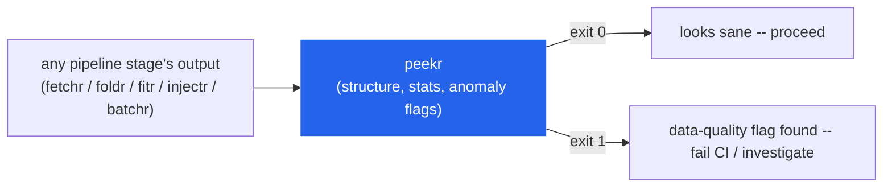
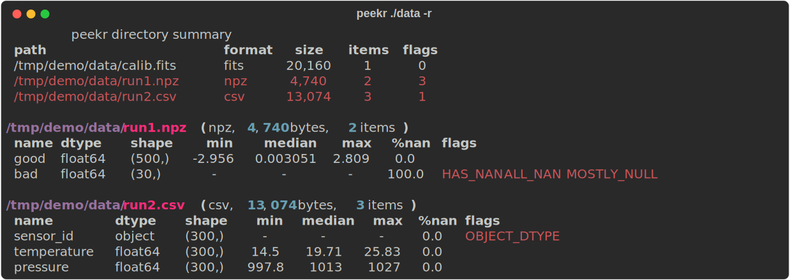
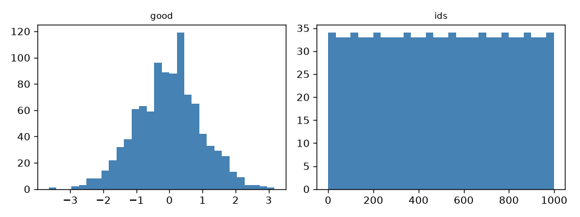

# peekr

A universal scientific data file explorer for the command line.

Point `peekr` at any `.npy`, `.npz`, `.fits`, `.csv`, `.parquet`, or `.h5` file (or a
directory of them) and it instantly shows you what's inside: structure,
stats, quick plots, and automatic anomaly flags (NaNs, constant columns,
outliers, suspicious dtypes) — `ls` + `head` + `describe()` + "is this file
sane?" in one command, without opening a notebook.


`peekr` isn't tied to any one stage of a pipeline — it's the tool you point
at *any* intermediate file (a `fetchr`-synced `.npz`, a `foldr` output, an
`injectr` fixture, a `batchr` cache object) when something looks off, or as
an automated sanity gate between stages:



## Install

```bash
pip install git+https://github.com/nikhilcherry/peekr
```

With optional format/plotting support:

```bash
pip install "peekr[fits] @ git+https://github.com/nikhilcherry/peekr"
pip install "peekr[csv] @ git+https://github.com/nikhilcherry/peekr"
pip install "peekr[parquet] @ git+https://github.com/nikhilcherry/peekr"
pip install "peekr[h5] @ git+https://github.com/nikhilcherry/peekr"
pip install "peekr[plot] @ git+https://github.com/nikhilcherry/peekr"

# everything
pip install "peekr[all] @ git+https://github.com/nikhilcherry/peekr"
```

## Usage

### Inspect a single file

```bash
$ peekr experiment.npz
```

```
/tmp/demo/experiment.npz  (npz, 17,138 bytes, 3 items)
┌──────┬─────────┬─────────┬────────┬──────────┬───────┬───────┬─────────────────────────────┐
│ name │ dtype   │ shape   │    min │   median │   max │  %nan │ flags                       │
├──────┼─────────┼─────────┼────────┼──────────┼───────┼───────┼─────────────────────────────┤
│ good │ float64 │ (1000,) │ -3.648 │ 0.006178 │ 3.179 │   0.0 │                             │
│ bad  │ float64 │ (50,)   │      - │        - │     - │ 100.0 │ HAS_NAN ALL_NAN MOSTLY_NULL │
│ ids  │ int64   │ (1000,) │      0 │    499.5 │   999 │   0.0 │ MONOTONIC                   │
└──────┴─────────┴─────────┴────────┴──────────┴───────┴───────┴─────────────────────────────┘
```

(`ids` is flagged `MONOTONIC` — informational, doesn't affect exit code. `bad`
is flagged for real: all-NaN, mostly-null. Piped/non-TTY output widens
automatically and folds long flag lists instead of clipping them — see
`--wide` below.)

### Machine-readable output for CI

```bash
$ peekr experiment.npz --json | python -m json.tool
```

```json
{
  "path": "/tmp/demo/experiment.npz",
  "format": "npz",
  "size_bytes": 17138,
  "n_items": 3,
  "summaries": [
    {
      "name": "bad",
      "dtype": "float64",
      "shape": [50],
      "n_total": 50,
      "n_nan": 50,
      "n_inf": 0,
      "min": null,
      "max": null,
      "mean": null,
      "median": null,
      "std": null,
      "n_unique": 1,
      "flags": ["HAS_NAN", "ALL_NAN", "MOSTLY_NULL"]
    }
  ],
  "metadata": { "allow_pickle": false },
  "errors": []
}
```

### Use it as a CI data-quality gate

`peekr` exits `1` the moment it finds a real data-quality flag (`0` if the
file is clean, `2` if it couldn't even be read) — no extra flags or plumbing
needed, just check the exit code:

```bash
# fail the build if any parquet output has NaNs, constant columns, etc.
peekr data/*.parquet || { echo "data quality check failed"; exit 1; }
```

### Scan a whole directory

```bash
$ peekr ./data -r
```

```
                    peekr directory summary
┌───────────────────────────┬────────┬────────┬───────┬───────┐
│ path                      │ format │   size │ items │ flags │
├───────────────────────────┼────────┼────────┼───────┼───────┤
│ ./data/calib.fits         │ fits   │ 20,160 │     1 │     0 │
│ ./data/run1.npz           │ npz    │  4,740 │     2 │     3 │
│ ./data/run2.csv           │ csv    │ 13,074 │     3 │     1 │
└───────────────────────────┴────────┴────────┴───────┴───────┘

./data/run1.npz  (npz, 4,740 bytes, 2 items)
┌──────┬─────────┬────────┬────────┬──────────┬───────┬───────┬─────────────────────────────┐
│ name │ dtype   │ shape  │    min │   median │   max │  %nan │ flags                       │
├──────┼─────────┼────────┼────────┼──────────┼───────┼───────┼─────────────────────────────┤
│ good │ float64 │ (500,) │ -2.956 │ 0.003051 │ 2.809 │   0.0 │                             │
│ bad  │ float64 │ (30,)  │      - │        - │     - │ 100.0 │ HAS_NAN ALL_NAN MOSTLY_NULL │
└──────┴─────────┴────────┴────────┴──────────┴───────┴───────┴─────────────────────────────┘

./data/run2.csv  (csv, 13,074 bytes, 3 items)
┌─────────────┬─────────┬────────┬───────┬────────┬───────┬──────┬──────────────┐
│ name        │ dtype   │ shape  │   min │ median │   max │ %nan │ flags        │
├─────────────┼─────────┼────────┼───────┼────────┼───────┼──────┼──────────────┤
│ sensor_id   │ object  │ (300,) │     - │      - │     - │  0.0 │ OBJECT_DTYPE │
│ temperature │ float64 │ (300,) │  14.5 │  19.71 │ 25.83 │  0.0 │              │
│ pressure    │ float64 │ (300,) │ 997.8 │   1013 │  1027 │  0.0 │              │
└─────────────┴─────────┴────────┴───────┴────────┴───────┴──────┴──────────────┘
```

Only flagged files get expanded in the detail view — `calib.fits` is clean
here, so it's summarized in the top table but not printed again below. Long
paths/names/flag lists get wider room automatically when stdout isn't a
terminal (e.g. piped to a file or CI log); pass `--wide` to widen further, or
when you're piping and still want minimal truncation.



### Quick-look plots

```bash
peekr experiment.npz --plot
# -> experiment.peekr.png next to the file
```

Auto-generates a histogram (1-D), heatmap (2-D), or histogram grid (tabular)
per array/column, skipping ones that are all-NaN or empty:



## Anomaly flags

| Code | Condition |
|---|---|
| `HAS_NAN` | any NaN present |
| `HAS_INF` | any ±inf present |
| `ALL_NAN` | every value NaN |
| `CONSTANT` | ≥2 elements, all identical |
| `NEAR_CONSTANT` | std < 1e-12 × abs(mean), non-zero mean |
| `OUTLIERS` | >0.1% of values beyond 10× MAD from median |
| `MONOTONIC` | strictly increasing/decreasing numeric 1-D array (informational — likely a time/index axis) |
| `EMPTY` | zero elements |
| `OBJECT_DTYPE` | dtype is object (pickled data smell in npz) |
| `HIGH_CARDINALITY` | 1-D column where n_unique == n_total > 1000 (likely an ID column, informational — not raised for 2-D+ data like images, where all-unique values are normal) |
| `MOSTLY_NULL` | >50% NaN/null |

`MONOTONIC` and `HIGH_CARDINALITY` are informational and do not affect the
exit code.

## Exit codes

| Code | Meaning |
|---|---|
| `0` | clean — no data-quality flags found |
| `1` | at least one data-quality flag found (excluding informational flags) |
| `2` | usage error or unreadable file |

## CLI reference

```
peekr FILE_OR_DIR [options]

options:
  --deep            compute expensive stats (percentiles, unique counts)
  --plot            save quick-look PNG(s) next to the file: <name>.peekr.png
  --plot-dir DIR    save PNGs to DIR instead
  --json            emit the FileReport(s) as JSON to stdout (machine-readable)
  --key NAME        only inspect this array/column/dataset (repeatable)
  --recursive, -r   recurse into subdirectories
  --max-rows N      cap rows read from tabular files
  --no-anomalies    skip anomaly detection
  --wide            wider table layout; reduces name/flag truncation, useful when piping
  --version
```

## Development

```bash
python -m venv venv && source venv/bin/activate
pip install -e ".[all,dev]"
pytest tests/ -q
```

## License

MIT
